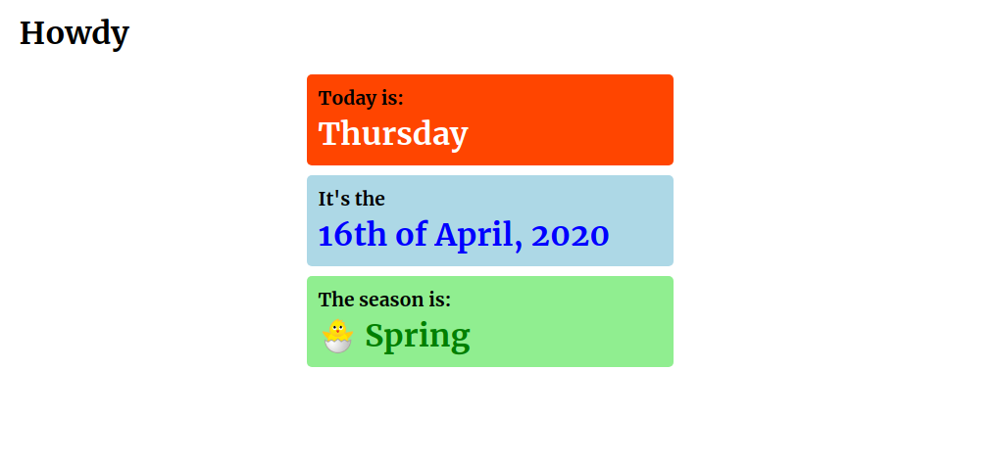

# HOWDY

This is designed as a really basic all-in-one view of today. It could be used in classrooms, or in care homes. It may also be useful as a quick view from a users device homescreen. It's early days, but hopefully it'll be useful for someone.

## To set up for development

1. Download the repo
1. Run `composer install`

Bonus, if you want to use homestead/vagrant to set up your development environment you can also run:

1. Run `php vendor/bin/homestead make` (see https://laravel.com/docs/7.x/homestead)
1. Run `vagrant up`

You'll also need to run npm on the vagrant box, so:

1. Run `vagrant ssh` to connect to the vagrant box
1. `cd` to the project directory, e.g. `cd /home/vagrant/code`
1. run `npm install`
1. run `npm run watch` to watch the files for changes and rebuild the output

You should be up and running :+1:

Once you've done all the setup, you can restart npm when you bring the vagrant box up by running:

`cd /home/vagrant/code && npm run watch`

## Roadmap

1. Add more cards e.g. #2
1. Add flex view to put the cards side by side on suitable displays
1. Add login, to provide the ability to select/deselect cards depending on requirements
1. Enable configuring colours
1. Make it a PWA so it can live as an icon on the homescreen

## License

This is open-sourced software licensed under the [MIT license](https://opensource.org/licenses/MIT).

## Support

If I've helped, feel free to [buy me a cuppa](https://www.buymeacoffee.com/davidlumm).
